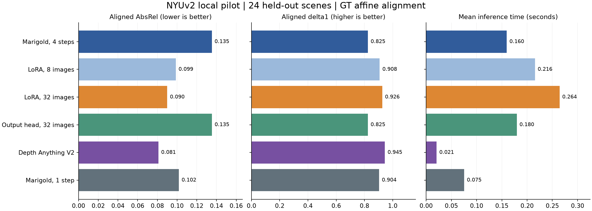
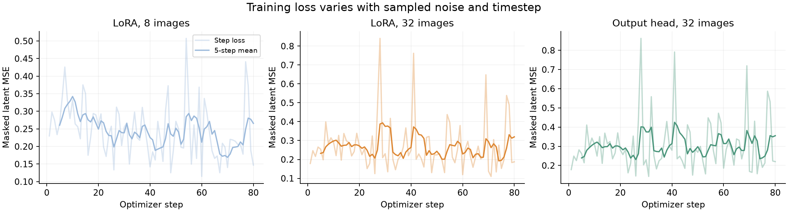
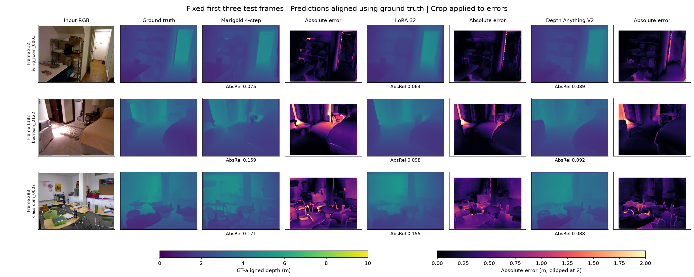

# Recorded pilot results

Means over 24 held-out test frames, one per scene. All scores use per-image ground-truth affine alignment. Lower AbsRel/RMSE and higher delta1 are better. These are relative-depth scores, not uncalibrated metric-depth accuracy.

| Method | AbsRel | RMSE (m) | delta1 | Seconds/image | Peak allocated MiB |
|---|---:|---:|---:|---:|---:|
| Marigold, 4 steps | 0.1353 | 0.5334 | 0.8249 | 0.160 | 2602 |
| LoRA, 8 images | 0.0988 | 0.3916 | 0.9078 | 0.216 | 2616 |
| LoRA, 32 images | 0.0900 | 0.3703 | 0.9264 | 0.264 | 2616 |
| Output head, 32 images | 0.1354 | 0.5260 | 0.8246 | 0.180 | 2605 |
| Depth Anything V2 | 0.0811 | 0.3393 | 0.9446 | 0.021 | 158 |
| Marigold, 1 step | 0.1019 | 0.4151 | 0.9041 | 0.075 | 2602 |

## Adaptation cost

| Method | Images | Trainable parameters | Training seconds | Latent-cache seconds | Peak allocated MiB |
|---|---:|---:|---:|---:|---:|
| lora | 8 | 829,952 | 29.7 | 0.8 | 2416 |
| lora | 32 | 829,952 | 33.2 | 1.9 | 2416 |
| head | 32 | 11,524 | 6.1 | 1.8 | 2386 |

## Paired uncertainty

Paired scene bootstrap of test AbsRel differences versus pretrained Marigold (4 steps), 10,000 resamples, seed 4240. Negative differences favor the compared method. This interval only reflects the selected scenes, not training-seed or dataset uncertainty; comparisons are exploratory and not corrected for multiplicity.

| Method | AbsRel difference | 95% bootstrap interval |
|---|---:|---|
| LoRA, 8 images | -0.0365 | [-0.0569, -0.0199] |
| LoRA, 32 images | -0.0453 | [-0.0735, -0.0233] |
| Output head, 32 images | +0.0001 | [-0.0026, +0.0027] |
| Depth Anything V2 | -0.0542 | [-0.0846, -0.0289] |
| Marigold, 1 step | -0.0334 | [-0.0524, -0.0172] |

## Figures

Validation results and individual-image measurements are available in the CSV and JSON files in this directory. No checkpoint was selected using test results.
