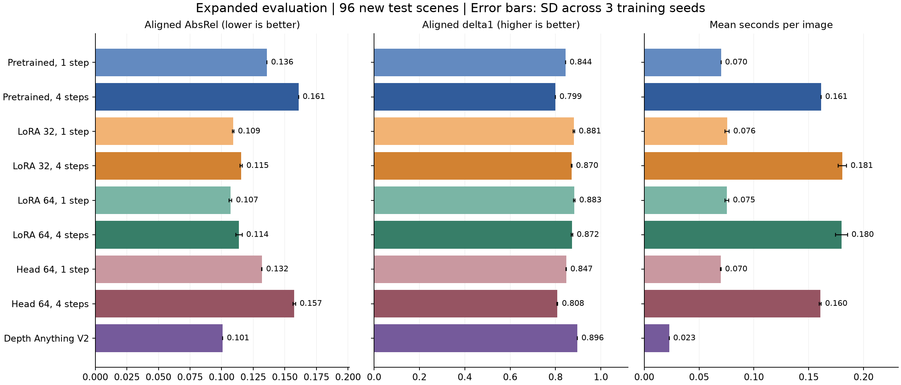
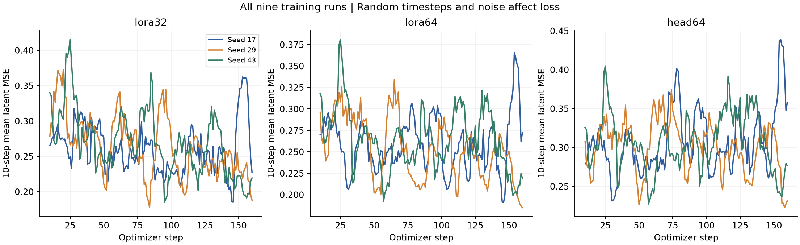
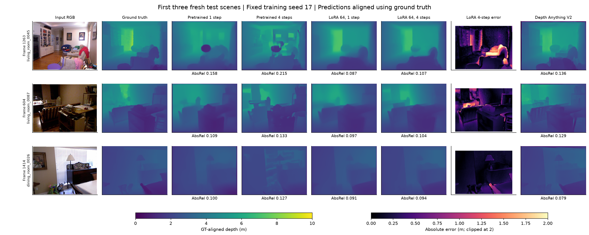

# Expanded evaluation v1 results

Primary evaluation: **96 new test scenes**, excluding the 24 scenes observed in the pilot. Each scene contributes one frame. Training uses the nested original32 or expanded64 pools, validation uses 16 distinct scenes, and the combined test set has 120 scenes. All nine adaptation runs use 160 updates and seeds 17, 29 and 43. Inference noise is fixed independently of training seed.

All depth metrics use the same per-image ground-truth affine alignment and valid-pixel protocol. They measure relative depth structure, not uncalibrated metric depth. Adapted entries are mean +/- sample SD across three training seeds; baseline entries have one fixed inference realization. These SDs are not scene confidence intervals.

## Primary results on fresh96

| Method | Runs | AbsRel | RMSE (m) | delta1 | Seconds/image |
|---|---:|---:|---:|---:|---:|
| Pretrained, 1 step | 1 | 0.1359 | 0.4813 | 0.8439 | 0.0701 |
| Pretrained, 4 steps | 1 | 0.1609 | 0.5666 | 0.7993 | 0.1614 |
| LoRA 32, 1 step | 3 | 0.1091 +/- 0.0005 | 0.4132 +/- 0.0030 | 0.8809 +/- 0.0034 | 0.0756 +/- 0.0019 |
| LoRA 32, 4 steps | 3 | 0.1154 +/- 0.0009 | 0.4351 +/- 0.0021 | 0.8703 +/- 0.0017 | 0.1807 +/- 0.0039 |
| LoRA 64, 1 step | 3 | 0.1070 +/- 0.0011 | 0.4068 +/- 0.0002 | 0.8827 +/- 0.0037 | 0.0754 +/- 0.0018 |
| LoRA 64, 4 steps | 3 | 0.1138 +/- 0.0024 | 0.4287 +/- 0.0054 | 0.8720 +/- 0.0034 | 0.1800 +/- 0.0054 |
| Head 64, 1 step | 3 | 0.1318 +/- 0.0002 | 0.4742 +/- 0.0004 | 0.8470 +/- 0.0003 | 0.0698 +/- 0.0002 |
| Head 64, 4 steps | 3 | 0.1575 +/- 0.0010 | 0.5475 +/- 0.0027 | 0.8077 +/- 0.0022 | 0.1605 +/- 0.0008 |
| Depth Anything V2 | 1 | 0.1009 | 0.3916 | 0.8963 | 0.0228 |

## Matched and paired comparisons

The difference is compared minus reference AbsRel on fresh96; negative favors the compared method. Scene metrics are averaged across training seeds before a paired bootstrap (10,000 resamples, seed 4240). Intervals reflect scene variation only, with no multiplicity correction. The training-seed SD above must be considered separately.

| Compared | Reference | AbsRel difference | 95% scene bootstrap interval |
|---|---|---:|---|
| LoRA 32, 1 step | Pretrained, 1 step | -0.0267 | [-0.0418, -0.0165] |
| LoRA 32, 4 steps | Pretrained, 4 steps | -0.0454 | [-0.0613, -0.0323] |
| LoRA 64, 1 step | Pretrained, 1 step | -0.0289 | [-0.0426, -0.0196] |
| LoRA 64, 4 steps | Pretrained, 4 steps | -0.0471 | [-0.0625, -0.0344] |
| Head 64, 1 step | Pretrained, 1 step | -0.0041 | [-0.0125, +0.0011] |
| Head 64, 4 steps | Pretrained, 4 steps | -0.0034 | [-0.0058, -0.0011] |
| Pretrained, 1 step | Pretrained, 4 steps | -0.0250 | [-0.0350, -0.0168] |
| LoRA 64, 1 step | LoRA 64, 4 steps | -0.0068 | [-0.0096, -0.0042] |
| LoRA 64, 1 step | LoRA 32, 1 step | -0.0022 | [-0.0046, +0.0003] |
| LoRA 64, 4 steps | LoRA 32, 4 steps | -0.0017 | [-0.0038, +0.0005] |
| Depth Anything V2 | Pretrained, 1 step | -0.0350 | [-0.0541, -0.0207] |

## Training cost

Training and latent preparation are timed separately; model loading and downloads are excluded. Peak memory is PyTorch allocated memory, not whole-device VRAM.

| Condition | Seed | Trainable parameters | Training seconds | Cache seconds | Peak MiB |
|---|---:|---:|---:|---:|---:|
| lora32 | 17 | 829,952 | 38.8 | 1.2 | 2415 |
| lora32 | 29 | 829,952 | 42.8 | 1.1 | 2417 |
| lora32 | 43 | 829,952 | 36.1 | 1.1 | 2417 |
| lora64 | 17 | 829,952 | 37.5 | 2.1 | 2417 |
| lora64 | 29 | 829,952 | 34.7 | 2.1 | 2417 |
| lora64 | 43 | 829,952 | 37.8 | 2.2 | 2417 |
| head64 | 17 | 11,524 | 7.0 | 2.2 | 2396 |
| head64 | 29 | 11,524 | 6.7 | 2.1 | 2396 |
| head64 | 43 | 11,524 | 6.5 | 2.2 | 2396 |

## Secondary cohort checks

| Method | Combined120 AbsRel | Original pilot24 AbsRel | Validation16 AbsRel |
|---|---:|---:|---:|
| Pretrained, 1 step | 0.1291 | 0.1019 | 0.1163 |
| Pretrained, 4 steps | 0.1557 | 0.1353 | 0.1334 |
| LoRA 32, 1 step | 0.1044 +/- 0.0005 | 0.0853 +/- 0.0010 | 0.0995 +/- 0.0015 |
| LoRA 32, 4 steps | 0.1104 +/- 0.0005 | 0.0900 +/- 0.0015 | 0.1016 +/- 0.0011 |
| LoRA 64, 1 step | 0.1029 +/- 0.0008 | 0.0868 +/- 0.0007 | 0.0988 +/- 0.0021 |
| LoRA 64, 4 steps | 0.1094 +/- 0.0021 | 0.0921 +/- 0.0007 | 0.1016 +/- 0.0021 |
| Head 64, 1 step | 0.1267 +/- 0.0002 | 0.1062 +/- 0.0007 | 0.1174 +/- 0.0004 |
| Head 64, 4 steps | 0.1529 +/- 0.0010 | 0.1347 +/- 0.0010 | 0.1298 +/- 0.0010 |
| Depth Anything V2 | 0.0969 | 0.0811 | 0.0880 |

The specialist has prior NYUv2 supervision, so validation16 is not clean held-out validation for it. It also uses different image processing (252x336 versus Marigold 192x256) and FP32 inference. It is a reference rather than a controlled architecture ablation.

## Figures

## Scope and limitations

This fixed matrix extends the pilot; no winner was selected and no hyperparameters were changed using these new test scores. Compared with the pilot, the optimizer budget doubles from 80 to 160, so differences across phases cannot be attributed solely to more data. Within this phase, training sizes share equal update budgets, not equal epochs. Only three training seeds, one data selection, one inference-noise realization, one dataset and low input resolution were studied. Timing is a single sequential pass on a working laptop, not a controlled performance benchmark. Later development must use validation data; these reported test scenes are now observed research evaluation data.

The companion CSV files preserve every run, cohort, comparison and training cost. `lora64_s4_hardest_scenes.csv` is a transparent post-hoc diagnostic list, not a basis for choosing training parameters. See `verification.json` for the completed provenance and prediction checks.
