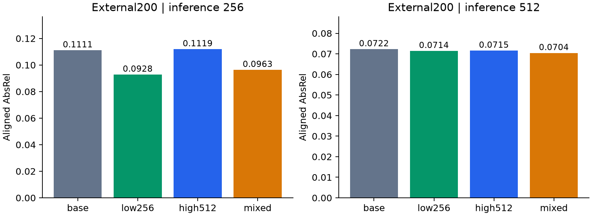
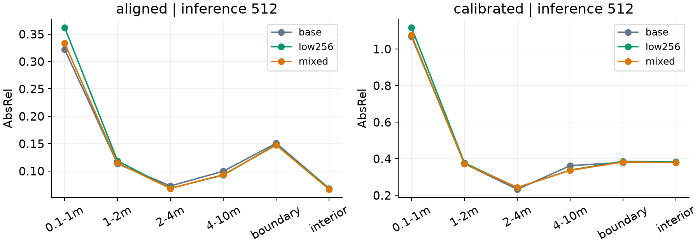
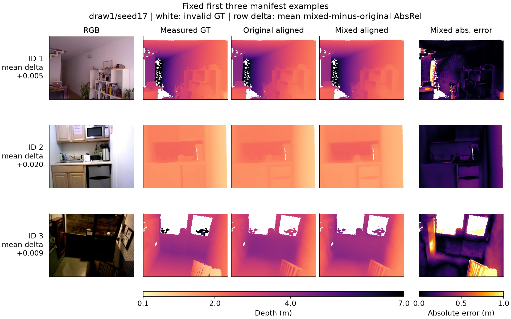
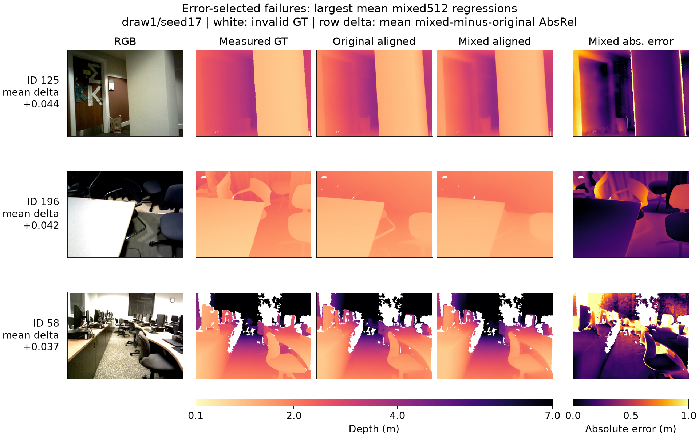
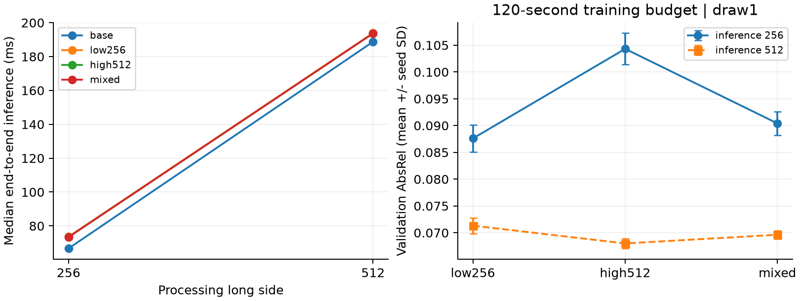

# Final-report exploratory completion study

**All test cohorts were already observed. This extension is exploratory and does not change the original frozen six-comparison conclusions.**

## Matched low-resolution control

Fifteen new low256 adapters use exactly the v3 three training draws, five seeds and 320-update recipe. All 7,890 predictions on validation32, NYUv2-31 and external200 were recomputed from saved raw arrays; all 15 checkpoints were restored at both inference resolutions.

| Group | External aligned AbsRel | NYUv2-31 aligned AbsRel |
|---|---:|---:|
| base_r256 | 0.11106 | 0.12686 |
| base_r512 | 0.07224 | 0.09687 |
| high512_r256 | 0.11188 | 0.12696 |
| high512_r512 | 0.07154 | 0.08339 |
| mixed_r256 | 0.09632 | 0.10128 |
| mixed_r512 | 0.07038 | 0.08462 |
| low256_r256 | 0.09277 | 0.09905 |
| low256_r512 | 0.07140 | 0.08918 |

## Separate eight-comparison exploratory family

The following Holm correction includes the six old contrast definitions plus mixed-versus-low256 at both resolutions. It is separate from the unchanged published six-test family.

| Contrast | Difference | Nested Holm8 | Crossed Holm8 | Location Holm8 |
|---|---:|---:|---:|---:|
| mixed_r256 - base_r256 | -0.01474 | 0.00040 | 0.00040 | 0.00210 |
| mixed_r512 - base_r512 | -0.00186 | 0.33298 | 0.41038 | 0.61617 |
| high512_r256 - base_r256 | +0.00082 | 0.99245 | 1.00000 | 1.00000 |
| high512_r512 - base_r512 | -0.00070 | 0.99245 | 1.00000 | 1.00000 |
| mixed_r256 - high512_r256 | -0.01556 | 0.00040 | 0.00040 | 0.00040 |
| mixed_r512 - high512_r512 | -0.00116 | 0.33298 | 0.35048 | 0.36798 |
| mixed_r256 - low256_r256 | +0.00355 | 0.00150 | 0.01560 | 0.03660 |
| mixed_r512 - low256_r512 | -0.00101 | 0.33298 | 0.41038 | 0.39578 |

Separate post-hoc interaction diagnostic, (mixed256-base256)-(mixed512-base512): -0.01288; crossed percentile95% [-0.01800, -0.00808], unadjusted p=0.00005. This is an exploratory single contrast, not prospective confirmation or a causal mechanism test.

## Depth-range and boundary diagnostics

Each bin is averaged equally over contributing scenes and runs (at least100 measured pixels per scene). Boundaries come from GT neighbor jumps >0.1m and >5%, dilated two pixels. Different bins need not have the same scene counts. No additional significance claims are made.

## Controlled cost measurement

Five randomized condition rounds, first eight validation images, three warmups per condition. All320 measured predictions exactly reproduce saved references. Times cover preprocessing through resized CPU output, with CUDA synchronization; loading excluded. Telemetry is retained, but one laptop and one checkpoint per method do not establish general hardware efficiency.

| Condition | Median ms | p10 ms | p90 ms | Peak MiB |
|---|---:|---:|---:|---:|
| base_r256 | 66.71 | 66.02 | 67.49 | 2602.2 |
| base_r512 | 188.75 | 188.02 | 191.30 | 2945.1 |
| high512_r256 | 73.47 | 72.90 | 74.61 | 2603.8 |
| high512_r512 | 193.67 | 193.11 | 196.55 | 2946.7 |
| mixed_r256 | 73.41 | 72.59 | 76.59 | 2604.1 |
| mixed_r512 | 193.75 | 193.20 | 196.23 | 2946.7 |
| low256_r256 | 73.59 | 72.93 | 76.08 | 2603.8 |
| low256_r512 | 193.84 | 193.39 | 195.90 | 2946.7 |

The fixed-time diagnostic trains low/high/mixed for120seconds per seed on draw1, with three seeds. Warmups do not update weights; cache/loading/warmup excluded. Stop at the first completed update reaching the budget. Only validation32 is evaluated; this is not an unseen generalization test.

| Method | Inference | Validation AbsRel mean | Seed SD | Completed updates |
|---|---:|---:|---:|---|
| low256 | 256 | 0.08761 | 0.00250 | [405, 431, 454] |
| low256 | 512 | 0.07132 | 0.00150 | [405, 431, 454] |
| high512 | 256 | 0.10431 | 0.00293 | [422, 407, 405] |
| high512 | 512 | 0.06801 | 0.00093 | [422, 407, 405] |
| mixed | 256 | 0.09041 | 0.00219 | [390, 398, 426] |
| mixed | 512 | 0.06963 | 0.00076 | [390, 398, 426] |

All prior data, weights and prediction arrays remain local. This report supplements the unchanged [prospective results](../prospective_v4/RESULTS.md).
