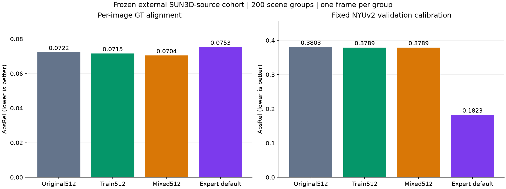
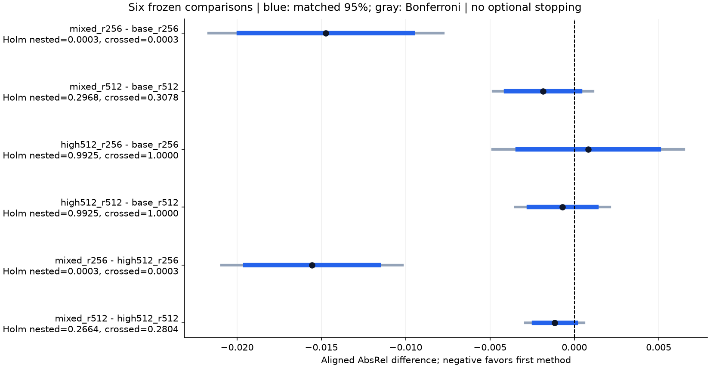
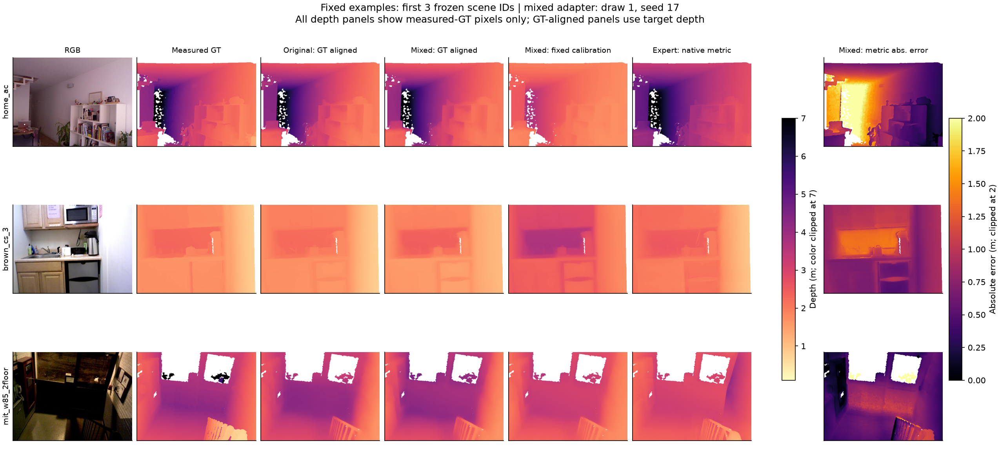

# Prospective external validation after sample-size planning

All 12,600 predictions across 63 conditions and 200 distinct SUN3D-source scene groups passed the audit. The cohort, all 30 existing adapters, preprocessing, six comparisons, and stopping rule were frozen before external inference. No additional training, model selection, external calibration, or significance-based stopping occurred.

## Primary finding

At 512 inference, original Marigold has aligned AbsRel 0.07224, and mixed-resolution adaptation has 0.07038 (+2.6% relative error reduction). The predefined nested/crossed Holm-adjusted p-values are 0.29684 / 0.30778. Directional improvement satisfies both predefined tests: **False**. The broader-location proxy sensitivity has Holm p=0.61617; it supports the same directional claim: **False**.

A favorable or unfavorable result on this fixed external cohort cannot establish universal model superiority. Nonsignificance is not equivalence or proof of zero effect. Any disagreement with the location sensitivity limits the robustness claim.

The earlier fresh31 NYUv2 mixed512-versus-original512 result remains unconfirmed (nested/crossed Holm p=0.1088/0.1094). This external experiment answers a separate generalization question; it neither changes that historical test nor pools its observations into a larger NYUv2 test.

## What the experiment supports

At 256 inference, mixed training reduces aligned AbsRel from 0.11106 to 0.09632 (13.3% lower). Both predefined Holm tests support this contrast (p=0.00030 / 0.00030), as does the location sensitivity (p=0.00150). Mixed training also improves on high-resolution-only training at 256 inference (nested/crossed/location Holm p=0.00030 / 0.00030 / 0.00030). These comparisons were members of the original six-comparison family, not added after seeing the results.

The defensible interpretation is a benefit at low inference resolution on this external cohort. No tested 512-inference contrast passes the predefined improvement rule. This pattern is consistent with resolution-dependent transfer, but no formal interaction test was specified; a significant low-resolution result and a nonsignificant high-resolution result alone do not establish an interaction.

Fixed-calibration mixed512 AbsRel is 0.37886, compared with 0.18231 for the specialist. Thus good GT-aligned structure does not establish accurate absolute distances. The specialist comparison is descriptive and is outside the six formal contrasts.

## Planning versus realized evidence

The [power study](power/RESULTS.md) used only earlier NYUv2 results. For a hypothesized 0.009 gain and fresh31-like variation, the known-pilot-distribution approximation estimated 84.3% power at 200 groups with 3 draws x 5 seeds. Inflating error SD by 1.5 lowered this estimate to 38.5%. Thus the budget was sufficient under a specific planning assumption, not a guarantee across domain shifts. These estimates are not observed post-hoc power and do not determine the final significance claims.

The realized mixed512 mean gain is 0.00186, well below the 0.009 planning assumption. This explains why the planning estimate cannot be cited as evidence that this external experiment should necessarily reject the null. The observed gain is itself uncertain; it is not a new sample-size target or a reason to extend this completed test until significant.

## Data and scope

Official SUNRGBD contains NYUv2, so only its SUN3D-source branch was eligible. The metadata census had 3,090 frames in 207 conservative source-space groups. SHA256-ranked groups/frames, raw-depth validity checks and duplicate checks were fixed before prediction. One frame per group prevents counting repeated video frames as independent scenes. This is a custom external cohort, not the full SUNRGBD benchmark or additional unseen NYUv2 data.
The 200 selected groups map to 63 broader location proxies. These are not verified building IDs; source groups can share physical context. Unknown image-pretraining overlap cannot be excluded. Per-group identities, source members, checksums, exclusions and availability are published in the manifests.

Evaluation uses raw measured depth pixels with 0.1 < GT < 10 m across the full image. The NYUv2 crop is not transferred. Per-image GT affine alignment evaluates relative structure. The separate metric-depth diagnostic reuses the prior NYUv2-validation calibration without fitting any external target. Changing dataset, sensor-validity mask and crop precludes directly pooling old and new benchmark scores.

## Scores

| Method | Aligned AbsRel | Aligned RMSE | Aligned delta1 | Calibrated AbsRel | Calibrated RMSE (m) | Calibrated delta1 |
|---|---:|---:|---:|---:|---:|---:|
| base_r256 | 0.11106 | 0.35647 | 0.88161 | 0.40006 | 0.99460 | 0.40897 |
| high512_r256 | 0.11188 | 0.35673 | 0.87626 | 0.39403 | 0.97918 | 0.41621 |
| mixed_r256 | 0.09632 | 0.31430 | 0.90983 | 0.38431 | 0.95897 | 0.42446 |
| base_r512 | 0.07224 | 0.25609 | 0.94551 | 0.38028 | 0.95591 | 0.40899 |
| high512_r512 | 0.07154 | 0.24980 | 0.94506 | 0.37889 | 0.94371 | 0.41554 |
| mixed_r512 | 0.07038 | 0.24634 | 0.94669 | 0.37886 | 0.94306 | 0.41762 |
| expert_default | 0.07528 | 0.26772 | 0.93997 | 0.18231 | 0.47903 | 0.75576 |

Specialist native metric output: AbsRel=0.29033, RMSE=0.70573m, delta1=0.55375. This Hypersim-fine-tuned model uses a different architecture, prior supervision and larger default input; it is a descriptive reference.

## Complete six-comparison family

| Comparison | Mean difference | Nested percentile 95% | Nested Holm p | Crossed Holm p | Location-proxy Holm p | Primary directional claim |
|---|---:|---|---:|---:|---:|---|
| mixed_r256 - base_r256 | -0.01474 | [-0.02002,-0.00970] | 0.00030 | 0.00030 | 0.00150 | True |
| mixed_r512 - base_r512 | -0.00186 | [-0.00408,+0.00032] | 0.29684 | 0.30778 | 0.61617 | False |
| high512_r256 - base_r256 | +0.00082 | [-0.00329,+0.00505] | 0.99245 | 1.00000 | 1.00000 | False |
| high512_r512 - base_r512 | -0.00070 | [-0.00270,+0.00132] | 0.99245 | 1.00000 | 1.00000 | False |
| mixed_r256 - high512_r256 | -0.01556 | [-0.01973,-0.01182] | 0.00030 | 0.00030 | 0.00030 | True |
| mixed_r512 - high512_r512 | -0.00116 | [-0.00248,+0.00001] | 0.26639 | 0.28039 | 0.29439 | False |

Percentile intervals and centered-bootstrap tests are different constructions; an interval excluding zero cannot override the predefined Holm decision. The plot shows symmetric centered-error intervals matched to the test, with all 12 underlying nested/crossed raw p-values exactly replayed. Bootstrap inference remains approximate with only three training draws.

## Fixed qualitative examples

The first three frozen manifest entries and the draw-1/seed-17 mixed adapter were fixed before examining outcomes. These examples are not selected by prediction error. The metric error panel uses the old NYUv2 calibration; GT-aligned panels use each image's measured target depth and cannot demonstrate absolute-distance accuracy.

## Cost and verification

- No new training. Summed measured inference time: 32.10 minutes; loading, restoration checks, data acquisition and audit excluded.
- Peak allocated inference VRAM: 2946.7 MiB. Laptop timing is descriptive, not a controlled hardware comparison.
- All 200 data hashes, 30 checkpoint hashes, 63 old-validation restoration checks, 12,600 raw predictions and recomputed scores verified.
- All old experiments remain unchanged. Raw data, weights and prediction arrays remain local; code, provenance, metrics and figures are published.
- The fixed 200-group result is final for this protocol, regardless of significance. Future modifications require a new independent validation plan.

Sources and frozen decisions: [protocol](../../PROSPECTIVE_PROTOCOL.md), [official SUNRGBD](https://rgbd.cs.princeton.edu/), [official SUN3D](https://sun3d.cs.princeton.edu/), [verification](verification.json).
