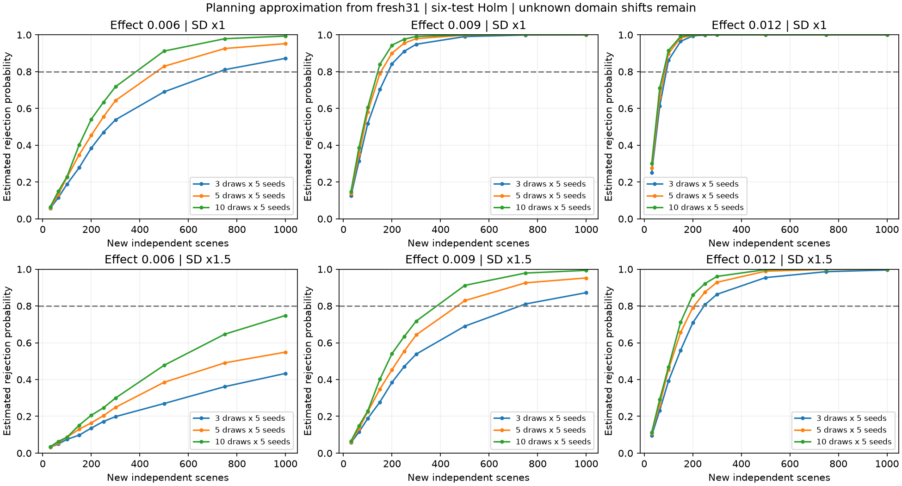

# Prospective sample-size planning

Prospective planning from pilot paired data; no external outcomes are read.

Known-pilot-distribution approximation: simulate joint centered crossed-bootstrap
errors for four base contrasts; derive all six coherent contrasts, then apply
two-sided empirical tail tests and Holm in every simulated trial. Both nested
and crossed calibration distributions must reject, as in the intended analysis.
Independent calibration and trial resamples, each 20,000. This does NOT re-estimate a bootstrap
distribution inside every future trial, and does NOT guarantee actual test power.

The pilot cohorts are analyzed separately. We do not pool their outcomes or treat simulations as new observations. Power is estimated for a negative mixed512-minus-base512 effect after Holm adjustment of all six contrasts. The proposed effects are assumptions, not promised improvements. Each simulated trial uses the complete joint contrast family.

| Pilot | Training draws | Error SD multiplier | Assumed AbsRel gain | First grid N for 80% | First grid N for 90% |
|---|---:|---:|---:|---:|---:|
| fresh31 | 3 | 1.0 | 0.006 | 750 | >1000 |
| fresh31 | 3 | 1.0 | 0.009 | 200 | 250 |
| fresh31 | 3 | 1.0 | 0.012 | 100 | 150 |
| fresh31 | 3 | 1.5 | 0.006 | >1000 | >1000 |
| fresh31 | 3 | 1.5 | 0.009 | 750 | >1000 |
| fresh31 | 3 | 1.5 | 0.012 | 250 | 500 |
| fresh31 | 5 | 1.0 | 0.006 | 500 | 750 |
| fresh31 | 5 | 1.0 | 0.009 | 200 | 200 |
| fresh31 | 5 | 1.0 | 0.012 | 100 | 150 |
| fresh31 | 5 | 1.5 | 0.006 | >1000 | >1000 |
| fresh31 | 5 | 1.5 | 0.009 | 500 | 750 |
| fresh31 | 5 | 1.5 | 0.012 | 250 | 300 |
| fresh31 | 10 | 1.0 | 0.006 | 500 | 500 |
| fresh31 | 10 | 1.0 | 0.009 | 150 | 200 |
| fresh31 | 10 | 1.0 | 0.012 | 100 | 100 |
| fresh31 | 10 | 1.5 | 0.006 | >1000 | >1000 |
| fresh31 | 10 | 1.5 | 0.009 | 500 | 500 |
| fresh31 | 10 | 1.5 | 0.012 | 200 | 250 |
| observed64 | 3 | 1.0 | 0.006 | 100 | 150 |
| observed64 | 3 | 1.0 | 0.009 | 64 | 64 |
| observed64 | 3 | 1.0 | 0.012 | 31 | 31 |
| observed64 | 3 | 1.5 | 0.006 | 250 | 300 |
| observed64 | 3 | 1.5 | 0.009 | 100 | 150 |
| observed64 | 3 | 1.5 | 0.012 | 64 | 64 |
| observed64 | 5 | 1.0 | 0.006 | 100 | 150 |
| observed64 | 5 | 1.0 | 0.009 | 64 | 64 |
| observed64 | 5 | 1.0 | 0.012 | 31 | 31 |
| observed64 | 5 | 1.5 | 0.006 | 250 | 300 |
| observed64 | 5 | 1.5 | 0.009 | 100 | 150 |
| observed64 | 5 | 1.5 | 0.012 | 64 | 64 |
| observed64 | 10 | 1.0 | 0.006 | 100 | 150 |
| observed64 | 10 | 1.0 | 0.009 | 64 | 64 |
| observed64 | 10 | 1.0 | 0.012 | 31 | 31 |
| observed64 | 10 | 1.5 | 0.006 | 200 | 300 |
| observed64 | 10 | 1.5 | 0.009 | 100 | 150 |
| observed64 | 10 | 1.5 | 0.012 | 64 | 64 |

## Limits

- Only 3 observed training draws and 5 seeds; resampling cannot discover unobserved variability.
- Pilot distribution reused as known planning distribution; actual future bootstrap test re-estimates uncertainty.
- No external outcomes enter planning; domain shift can change means, variance, tails and correlations.
- Candidate counts are distinct sampling units, not repeated frames from one room.
- Monte Carlo SE is simulation precision only, not uncertainty in estimated population power.

Sample size must be frozen before external inference. A finite accessible cohort may be smaller than the planning target; report that shortfall instead of claiming adequate power. Never stop upon significance or add scenes because the fixed test failed. No future significant result establishes universal superiority.
