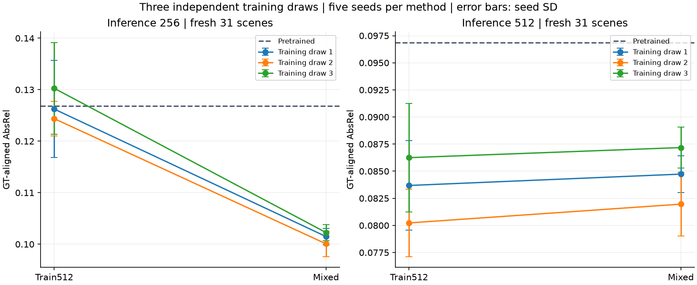
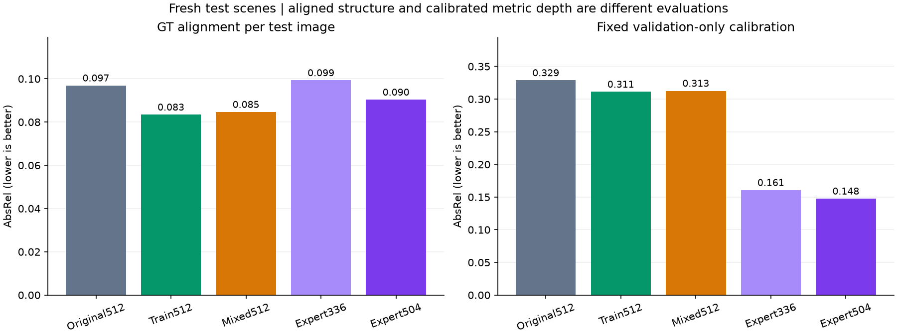
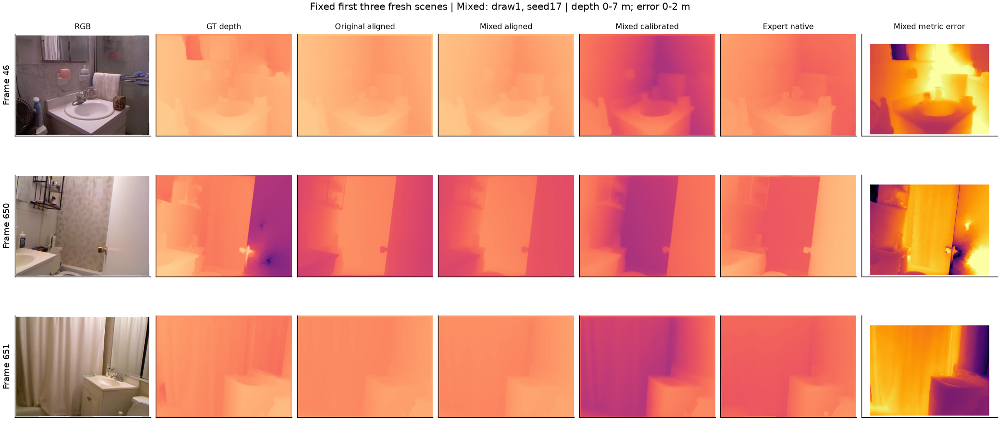
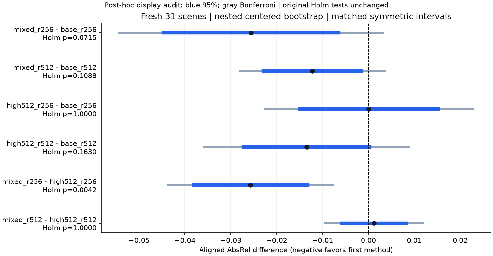

# Robustness replication: training draws, uncertainty, and depth calibration

This study tests whether the earlier mixed-resolution result survives new training samples, more seeds, multiplicity adjustment, and evaluation without fitting to test depths. The training/data design and primary analysis were frozen before the new runs; the crossed-seed sensitivity addendum was fixed during validation, before new test inference.

**Training-provenance correction:** the fixed Depth Anything V2 indoor reference was metric-fine-tuned on Hypersim, not NYUv2. Earlier NYUv2-supervision and derived validation-overlap descriptions are withdrawn; [the correction](../../CORRECTIONS.md) records the pinned model-card evidence. No weights or measurements changed.

## What the replication supports

- On the 31 fresh scenes, mixed512 reduces mean aligned AbsRel from 0.09687 to 0.08462 (12.6%). Each of the three training-draw means is below the pretrained score. However, the predefined six-comparison Holm tests do not confirm this improvement at 0.05 (nested p=0.1088; crossed p=0.1094). The result is a favorable point estimate with insufficient corrected evidence, not proof of no effect.
- At 256 inference, mixed training improves on high512-only training: aligned AbsRel 0.10128 versus 0.12696 (nested Holm p=0.0042; crossed p=0.0084). At 512 inference, mixed does not establish an advantage over high512-only training (0.08462 versus 0.08339; both Holm p=1). The supported benefit is resolution-dependent.
- On the previously observed 64 scenes, mixed512 improves on pretrained512 from 0.06661 to 0.06008 (nested Holm p=0.0102; crossed p=0.0174). This supports repeatability with new training draws on an already examined cohort; it cannot replace the fresh-cohort result.
- Without per-test-image GT alignment, mixed512 with fixed validation calibration has AbsRel 0.31261 and RMSE 0.9220 m. Its calibrated AbsRel improvement over pretrained512 (0.32862) survives the separate secondary six-comparison family (nested Holm p=0.0070; crossed p=0.0088), but absolute-distance errors remain substantial. The specialist at the approximately matched input size has calibrated AbsRel 0.14752.
- A separate post-hoc [official-default specialist diagnostic](../expert_default_diagnostic_v1/RESULTS.md) uses its unchanged 518x686 processor input. It gives native AbsRel 0.25369 and calibrated AbsRel 0.15036 on fresh31. Native performance changes substantially with preprocessing; conclusions cannot be based on only the smaller custom input. Its larger pixel budget makes this a descriptive reference, not another confirmatory contrast. The additional 127 predictions passed verification (9,309 verified predictions across both studies).

## Design and audit

- Three new scene-uniform training draws of 128 from 217 eligible scenes; five seeds (17,29,43,59,71); high512 and mixed; 30 fresh trainings of 320 updates.
- Training draws share 76, 68, and 68 scenes pairwise. They are independent random draws from a fixed pool, not disjoint datasets or three different domains.
- Fresh primary cohort: all 31 previously unused official test scenes. The already observed 64-scene cohort is secondary. The other 120 previously tested scenes were not rerun. All 215 official test scenes have now been observed across project phases.
- Validation-only calibration uses 32 scenes. All 9,182 saved predictions, 335 input hashes, 30 checkpoints, paired training schedules and four restoration checks passed the audit. No test result selected a checkpoint or hyperparameter.

- Historical baseline reproducibility: 288 raw prediction arrays are exactly equal to scaleup_v2.

## Fresh-scene scores

AbsRel, RMSE and delta1 below use the same crop/range. Each adapted entry averages three training draws and five seeds. Aligned metrics fit one affine transform using each test image's GT. Calibrated metrics use a fixed transform learned on validation only.

The adaptation target is normalized independently per image using depth quantiles, and Marigold outputs relative depth. The training objective therefore does not directly enforce meter-valued predictions. Fixed global calibration is a separate diagnostic of that limitation.

| Method | Aligned AbsRel | Aligned RMSE (m) | Aligned delta1 | Calibrated AbsRel | Calibrated RMSE (m) | Calibrated delta1 |
|---|---:|---:|---:|---:|---:|---:|
| base_r256 | 0.12686 | 0.4118 | 0.8481 | 0.36465 | 1.0535 | 0.4521 |
| high512_r256 | 0.12696 | 0.4205 | 0.8474 | 0.33039 | 0.9859 | 0.4988 |
| mixed_r256 | 0.10128 | 0.3474 | 0.9029 | 0.31592 | 0.9434 | 0.5261 |
| base_r512 | 0.09687 | 0.3231 | 0.8961 | 0.32862 | 0.9630 | 0.5177 |
| high512_r512 | 0.08339 | 0.2878 | 0.9233 | 0.31113 | 0.9214 | 0.5435 |
| mixed_r512 | 0.08462 | 0.2852 | 0.9183 | 0.31261 | 0.9220 | 0.5419 |
| expert256 | 0.09926 | 0.3289 | 0.8954 | 0.16059 | 0.5488 | 0.7939 |
| expert504 | 0.09031 | 0.3071 | 0.9110 | 0.14752 | 0.4950 | 0.8193 |

Native metric-depth references (no fitted scale or shift):

| Reference | AbsRel | RMSE (m) | delta1 |
|---|---:|---:|---:|
| expert256 native | 0.62411 | 1.5883 | 0.0722 |
| expert504 native | 0.37072 | 1.0201 | 0.3144 |
| Constant 2.595 m from validation | 0.41761 | 1.2078 | 0.3650 |

## Predefined fresh-scene comparisons

Negative differences favor the first method. Intervals below resample training draws, seeds within each draw, and paired test scenes. Holm p-values cover the six aligned comparisons as one family. Bootstrap p-values and interval coverage are approximate with only three training draws. The CSV also reports scene-only intervals and nominal Bonferroni-adjusted percentile intervals.

The pre-test [sensitivity addendum](../../STATISTICAL_SENSITIVITY_V3.md) also resamples seed indices jointly across training draws because numerical seeds share initialization/schedules. Both analyses are shown; no favorable analysis is selected.

**Interval/test distinction:** the predefined intervals are percentile intervals, while the p-values use centered absolute-deviation bootstrap tests. They are not mathematical inverses and can disagree for skewed samples. The predefined Holm-adjusted tests determine significance statements; a percentile interval excluding zero does not override them. The figure adds a post-hoc display audit with symmetric intervals matched to the centered test. All 12 underlying primary nested/crossed p-values are replayed exactly in `interval_consistency_audit.json`; no test or decision threshold changes.

| Comparison | Difference | Nested percentile 95% interval | Nested Holm p | Crossed percentile 95% interval | Crossed Holm p |
|---|---:|---|---:|---|---:|
| mixed_r256 - base_r256 | -0.02558 | [-0.04813, -0.00926] | 0.0715 | [-0.04824, -0.00924] | 0.0780 |
| mixed_r512 - base_r512 | -0.01225 | [-0.02467, -0.00317] | 0.1088 | [-0.02459, -0.00315] | 0.1094 |
| high512_r256 - base_r256 | +0.00010 | [-0.01752, +0.01310] | 1.0000 | [-0.01807, +0.01304] | 1.0000 |
| high512_r512 - base_r512 | -0.01348 | [-0.03065, -0.00249] | 0.1630 | [-0.03073, -0.00255] | 0.1642 |
| mixed_r256 - high512_r256 | -0.02568 | [-0.03943, -0.01435] | 0.0042 | [-0.03999, -0.01416] | 0.0084 |
| mixed_r512 - high512_r512 | +0.00124 | [-0.00501, +0.00918] | 1.0000 | [-0.00510, +0.00950] | 1.0000 |

## Previously observed 64-scene cohort

This cohort is a replication/sensitivity check for new trainings; it is not newly unseen test data.

| Method | Aligned AbsRel | Calibrated AbsRel |
|---|---:|---:|
| base_r256 | 0.11161 | 0.35803 |
| high512_r256 | 0.10687 | 0.32130 |
| mixed_r256 | 0.08555 | 0.30606 |
| base_r512 | 0.06661 | 0.33491 |
| high512_r512 | 0.06095 | 0.31148 |
| mixed_r512 | 0.06008 | 0.31126 |
| expert256 | 0.08877 | 0.15429 |
| expert504 | 0.07341 | 0.13825 |

## Controlled image perturbations

Fresh 31 scenes only. Mixed averages all 15 checkpoints; calibration stays fixed from clean validation. These descriptive checks test two synthetic perturbations within NYUv2, not cross-dataset generalization.

| Perturbation | Method | Aligned AbsRel | Change from clean | Calibrated AbsRel |
|---|---|---:|---:|---:|
| dark | base | 0.09697 | +0.00009 | 0.33255 |
| dark | mixed | 0.08316 | -0.00146 | 0.31134 |
| dark | expert | 0.09405 | +0.00374 | 0.14677 |
| blur | base | 0.09683 | -0.00004 | 0.33209 |
| blur | mixed | 0.08830 | +0.00367 | 0.31343 |
| blur | expert | 0.11144 | +0.02113 | 0.17729 |

The per-scene win fractions and paired descriptive changes are in `corruption_comparisons.json`; the specialist's native metric scores under each perturbation are in `corruption_summary.csv`.

## Retrospective multiple-comparison sensitivity

All 21 originally published scaleup_v2 contrasts are included in a post-hoc Holm family. This reanalysis averages the original three training seeds first and resamples scenes only; it does not retroactively make the original study preregistered.

| Earlier comparison | Difference | Holm p |
|---|---:|---:|
| low256_r256 - base_r256 | -0.03011 | 0.0010 |
| low256_r512 - base_r512 | -0.00107 | 0.8830 |
| high512_r256 - base_r256 | -0.00277 | 0.8830 |
| high512_r512 - base_r512 | -0.00586 | 0.0076 |
| mixed_r256 - base_r256 | -0.02616 | 0.0010 |
| mixed_r512 - base_r512 | -0.00693 | 0.0076 |
| mixed_prior_r256 - base_r256 | -0.02555 | 0.0010 |
| mixed_prior_r512 - base_r512 | -0.00694 | 0.0030 |
| high512_r256 - low256_r256 | +0.02735 | 0.0010 |
| mixed_r256 - low256_r256 | +0.00396 | 0.0588 |
| mixed_r256 - high512_r256 | -0.02339 | 0.0010 |
| mixed_prior_r256 - mixed_r256 | +0.00060 | 0.2577 |
| high512_r512 - low256_r512 | -0.00479 | 0.0058 |
| mixed_r512 - low256_r512 | -0.00586 | 0.0027 |
| mixed_r512 - high512_r512 | -0.00107 | 0.4586 |
| mixed_prior_r512 - mixed_r512 | -0.00001 | 0.9653 |
| base_r512 - base_r256 | -0.04500 | 0.0010 |
| low256_r512 - low256_r256 | -0.01595 | 0.0010 |
| high512_r512 - high512_r256 | -0.04809 | 0.0010 |
| mixed_r512 - mixed_r256 | -0.02577 | 0.0010 |
| mixed_prior_r512 - mixed_prior_r256 | -0.02638 | 0.0010 |

## Computational cost and limits

- New training total: 52.40 minutes, excluding latent caching, model loading, evaluation and data extraction; peak allocated training VRAM 2511.9 MiB.
- Individual training times range from 59.3 to 121.2 seconds. Late runs were substantially faster despite the same update budget. Hardware/runtime conditions were not controlled, so timing is descriptive and does not establish a causal method speedup.
- Three draws and five seeds strengthen the evidence within this finite NYUv2 pool, but do not establish universal performance. The fresh cohort has only 31 scenes and is deliberately separate from the previously observed cohort. This is not the standard full 654-frame NYUv2 benchmark.
- The specialist has different pretraining and Hypersim metric-depth fine-tuning, precision, architecture and compute. Its 378x504 input is approximately matched to Marigold 384x512, not an architecture-controlled comparison. The model-card evidence does not support the earlier claim of NYUv2-labeled training overlap with our validation scenes.
- Calibration removes test-target fitting but adds a simple validation-trained postprocessor. It does not convert the original Marigold architecture into a natively metric model; conclusions concern the measured calibrated system and indoor split.
- Mixed-prior and low256 were not retrained in this phase. No conclusion about their across-training-set robustness or equivalence is implied.
- Centered bootstrap p-values are approximate; small numbers of training draws constrain uncertainty estimates. Report effect sizes, both interval types, all seed/draw scores and the adjusted comparisons together.
- Inference noise is fixed per scene to isolate training effects. This study does not estimate variation over multiple inference-noise seeds.
- The 32 calibration scenes are held fixed. Calibrated-score intervals do not include uncertainty from selecting a different calibration dataset.
- Raw weights/data/predictions remain local. Code, hashes, coefficients, scores and figures are published in the private course repository.
