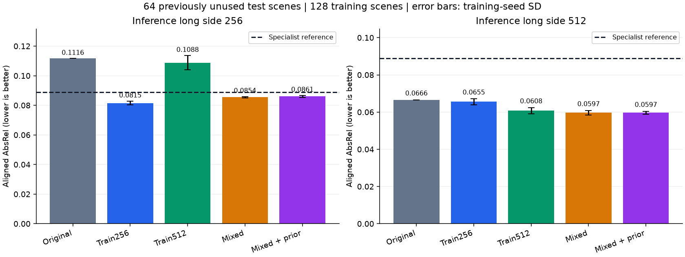
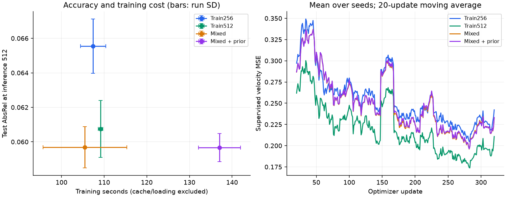
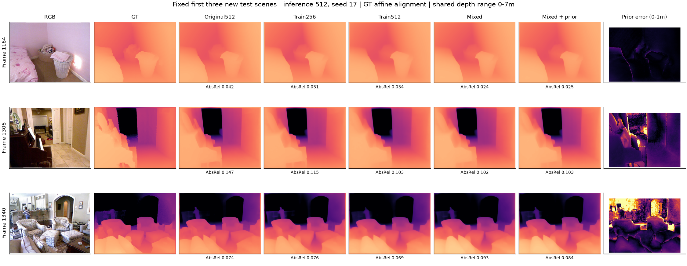

# Larger local experiment: training resolution and denoiser preservation

Completed 12 independent LoRA training runs (four methods x three seeds), each with 128 training scenes and 320 updates. Validation uses 32 scenes; the primary test uses 64 scenes never selected in earlier phases. All 27 predefined conditions were evaluated on both splits, giving 2,592 predictions. The full fixed matrix was evaluated after a technical validation audit; no winner was selected to determine test entries.

**All metrics use per-image ground-truth affine alignment: results concern relative depth geometry, not uncalibrated metric distance.**

## Main findings

At 512-pixel inference, mixed-resolution training reduces mean test AbsRel from 0.06661 to 0.05968 (10.4%). The paired difference is -0.00693, with a scene-bootstrap interval of [-0.01102, -0.00357]. Training only at 512 reaches 0.06075; the mixed-versus-high512 interval crosses zero, so the smaller mixed mean does not establish a reliable advantage over high-resolution-only training.

The best observed low-resolution result comes from training at 256: AbsRel 0.08149 versus 0.11161 for the original model. Mixed training reaches 0.08545 at that inference resolution. It therefore trades some low-resolution accuracy for stronger high-resolution performance; it does not dominate single-resolution adaptation at every operating point.

Uniform denoiser preservation adds no convincing high-resolution gain: 0.05967 versus 0.05968, with a paired difference interval of [-0.00045, +0.00058]. At 256, its mean is slightly worse (difference +0.00060; unadjusted interval [+0.00002, +0.00124]). Mean training time increases from 105.5 to 137.0 seconds, approximately 30%, excluding latent preparation. The lower observed high-resolution seed SD with preservation is based on only three seeds and is insufficient to establish a general stability benefit. These results do not support adding this particular penalty for improved mean accuracy.

The specialist reference reaches 0.08877 AbsRel at 22.7 ms/image. The better high-resolution Marigold scores come with much slower inference and different input processing; this is not evidence of general superiority over specialist depth models.

## Method and boundaries

`low256` and `high512` train at a single resolution; `mixed` alternates 256/512 updates. `mixed_prior` adds 0.1 times masked student-versus-original velocity MSE at identical noisy depth/RGB latents and timesteps. The original denoiser is obtained with the adapter disabled and no teacher gradients. This implements uniform denoiser-output preservation, not confidence weighting or cross-resolution geometric consistency. All adapters update 829,952 parameters; the same per-seed image order and timestep schedule were verified across methods.

## Primary fresh64 test results

| Training method | Inference long side / size | AbsRel mean +/- seed SD | RMSE (m) | Delta1 | Inference ms |
|---|---:|---:|---:|---:|---:|
| Original | 256 | 0.11161 | 0.4001 | 0.8823 | 72.0 |
| Original | 512 | 0.06661 | 0.2631 | 0.9560 | 203.0 |
| Train256 | 256 | 0.08149 +/- 0.00130 | 0.3188 | 0.9344 | 78.7 |
| Train256 | 512 | 0.06554 +/- 0.00158 | 0.2532 | 0.9514 | 210.1 |
| Train512 | 256 | 0.10884 +/- 0.00474 | 0.3941 | 0.8866 | 78.7 |
| Train512 | 512 | 0.06075 +/- 0.00165 | 0.2469 | 0.9595 | 210.4 |
| Mixed | 256 | 0.08545 +/- 0.00047 | 0.3310 | 0.9279 | 79.0 |
| Mixed | 512 | 0.05968 +/- 0.00119 | 0.2437 | 0.9601 | 209.3 |
| Mixed + prior | 256 | 0.08605 +/- 0.00063 | 0.3330 | 0.9269 | 77.1 |
| Mixed + prior | 512 | 0.05967 +/- 0.00081 | 0.2432 | 0.9601 | 206.4 |
| Depth Anything V2 | 252x336 | 0.08877 | 0.3423 | 0.9216 | 22.7 |

The Depth Anything V2 reference has different prior NYUv2 supervision, preprocessing and precision. It is not a controlled architecture comparison; its validation subset is not known to be unseen during prior training.

## Predefined paired test comparisons

Differences are compared minus reference; negative favors the compared method. Intervals bootstrap 64 scenes after averaging per-scene metrics over training seeds (10,000 resamples, seed 4254). They describe scene variation, not training-seed variation, and are not corrected for multiple comparisons.

| Compared | Reference | AbsRel difference | 95% scene interval |
|---|---|---:|---:|
| low256_r256 | base_r256 | -0.03011 | [-0.03761, -0.02310] |
| low256_r512 | base_r512 | -0.00107 | [-0.00379, +0.00150] |
| high512_r256 | base_r256 | -0.00277 | [-0.00762, +0.00267] |
| high512_r512 | base_r512 | -0.00586 | [-0.00942, -0.00279] |
| mixed_r256 | base_r256 | -0.02616 | [-0.03214, -0.02050] |
| mixed_r512 | base_r512 | -0.00693 | [-0.01102, -0.00357] |
| mixed_prior_r256 | base_r256 | -0.02555 | [-0.03115, -0.02027] |
| mixed_prior_r512 | base_r512 | -0.00694 | [-0.01059, -0.00393] |
| high512_r256 | low256_r256 | +0.02735 | [+0.01861, +0.03749] |
| mixed_r256 | low256_r256 | +0.00396 | [+0.00095, +0.00676] |
| mixed_r256 | high512_r256 | -0.02339 | [-0.03170, -0.01641] |
| mixed_prior_r256 | mixed_r256 | +0.00060 | [+0.00002, +0.00124] |
| high512_r512 | low256_r512 | -0.00479 | [-0.00754, -0.00215] |
| mixed_r512 | low256_r512 | -0.00586 | [-0.00872, -0.00353] |
| mixed_r512 | high512_r512 | -0.00107 | [-0.00247, +0.00023] |
| mixed_prior_r512 | mixed_r512 | -0.00001 | [-0.00045, +0.00058] |
| base_r512 | base_r256 | -0.04500 | [-0.05484, -0.03574] |
| low256_r512 | low256_r256 | -0.01595 | [-0.02241, -0.00993] |
| high512_r512 | high512_r256 | -0.04809 | [-0.05988, -0.03824] |
| mixed_r512 | mixed_r256 | -0.02577 | [-0.03219, -0.02011] |
| mixed_prior_r512 | mixed_prior_r256 | -0.02638 | [-0.03317, -0.02044] |

## Training cost

| Method | Seed | Training seconds | Cache seconds | Peak training MiB |
|---|---:|---:|---:|---:|
| low256 | 17 | 110.4 | 4.4 | 2415 |
| low256 | 29 | 107.4 | 4.3 | 2417 |
| low256 | 43 | 104.4 | 4.2 | 2417 |
| high512 | 17 | 109.5 | 13.8 | 2511 |
| high512 | 29 | 109.5 | 14.2 | 2511 |
| high512 | 43 | 108.5 | 13.9 | 2511 |
| mixed | 17 | 94.1 | 18.3 | 2511 |
| mixed | 29 | 111.4 | 18.0 | 2511 |
| mixed | 43 | 110.9 | 18.2 | 2511 |
| mixed_prior | 17 | 141.7 | 18.2 | 2511 |
| mixed_prior | 29 | 137.5 | 18.6 | 2511 |
| mixed_prior | 43 | 131.9 | 18.0 | 2511 |

Equal optimizer updates are not equal compute. The teacher requires an additional forward pass, while higher resolution changes compute per update. These results cannot establish superiority under an equal-time budget. Timing excludes loading/downloads and is measured on one working laptop.

## Figures

## Verification and limitations

All 224 sample hashes, official split membership, scene separation, 12 distinct finite checkpoints and all 2,592 prediction metrics were verified. Each method's seed-29 checkpoint reproduced a saved 512-pixel validation prediction exactly. Training/validation scene roles were preserved, and all 64 test scenes were excluded from previous manifests. See `verification.json` and `validation_gate.json` for provenance.

The study covers one 128-scene training subset, three training seeds, a fixed 320-update budget, one teacher weight and one inference seed per image. Comparisons with earlier phases also change data, schedules and test cohorts; they cannot isolate the effect of scale alone. This is not the full NYUv2 benchmark. Subsequent tuning must not use these test outcomes as an unseen final evaluation.

Reproduction: follow [SCALEUP_PROTOCOL.md](../../SCALEUP_PROTOCOL.md) and `run_scaleup.ps1`. Raw arrays and weights remain outside Git.
