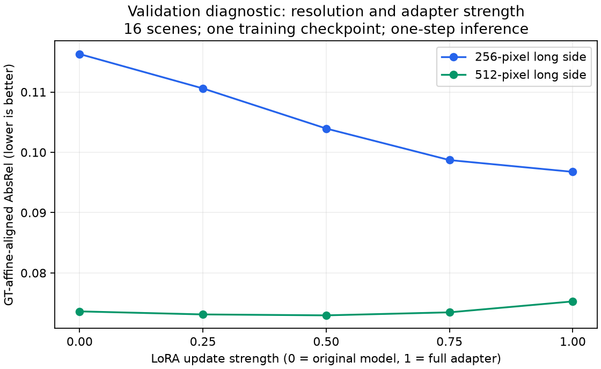

# LoRA strength diagnostic on validation scenes

All ten predefined settings completed. No training or test inference was performed. Scale-zero and scale-one predictions exactly reproduced 64 prior validation outputs. All 160 raw prediction hashes and recomputed metrics passed.

| Long side | LoRA strength | AbsRel | RMSE (m) | Delta1 |
|---|---:|---:|---:|---:|
| 256 | 0.00 | 0.116294 | 0.4463 | 0.8532 |
| 256 | 0.25 | 0.110593 | 0.4309 | 0.8685 |
| 256 | 0.50 | 0.103944 | 0.4110 | 0.8777 |
| 256 | 0.75 | 0.098711 | 0.3925 | 0.8862 |
| 256 | 1.00 | 0.096758 | 0.3835 | 0.8922 |
| 512 | 0.00 | 0.073620 | 0.3252 | 0.9416 |
| 512 | 0.25 | 0.073117 | 0.3235 | 0.9416 |
| 512 | 0.50 | 0.072963 | 0.3231 | 0.9415 |
| 512 | 0.75 | 0.073462 | 0.3246 | 0.9426 |
| 512 | 1.00 | 0.075273 | 0.3289 | 0.9431 |

## Interpretation

The observed grid minimum is strength 1.00 at resolution 256 and 0.50 at resolution 512. These settings are selected and evaluated on the same 16 already observed validation scenes. They are diagnostic descriptions, not independently validated gains. The per-resolution gate also has more selection freedom than a single fixed strength.

This interpolation is related to existing weight-ensembling methods such as [WiSE-FT](https://arxiv.org/abs/2109.01903). It is a baseline and a motivation for future work, not an original algorithm. A future method could combine mixed-resolution training, cross-resolution consistency and confidence-weighted preservation of the pretrained predictor. Such a method would need controlled ablations, several seeds and new unseen evaluation scenes.

See [the frozen protocol](../../SCALING_PROTOCOL.md), `comparisons.json` for paired scene intervals, and `verification.json`. Timings recorded per image are incidental single-pass diagnostics, not a speed benchmark.
