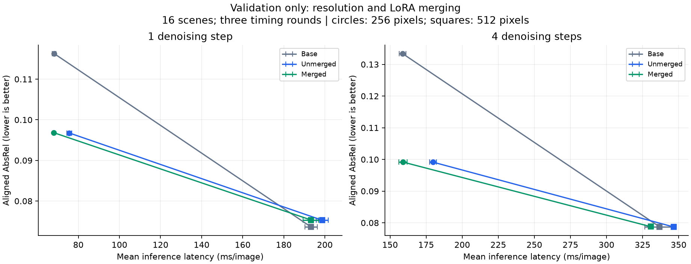
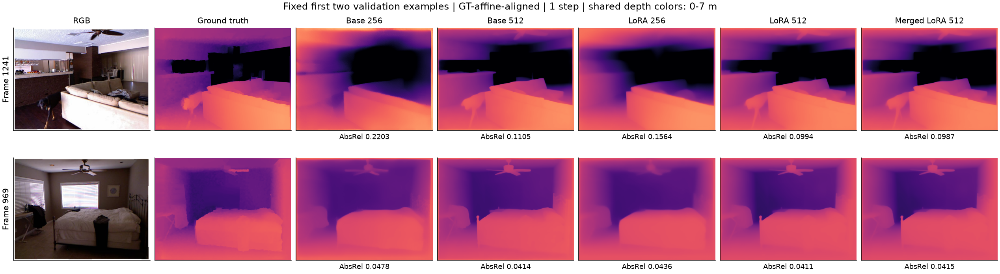

# Validation exploration: LoRA merging and inference resolution

Twelve predefined configurations completed three timing rounds on 16 validation scenes (576 predictions). All use the same fixed LoRA64 seed-17 checkpoint trained at long side 256; there is no additional training. Pretrained and LoRA results at resolution 256 reproduce all 64 corresponding expanded validation predictions exactly. The expanded test results were not changed or re-evaluated.

**These are exploratory validation results, not new held-out test results.** All scores use GT affine alignment and measure relative depth structure.

## Findings

Merging reduced measured latency by 9.9% (one step) and 11.6% (four steps) at resolution 256, with smaller 2.8% and 4.6% reductions at 512. Mean AbsRel changes were below 0.00009; all four paired scene intervals crossed zero. This is a useful local speed improvement with small observed mean accuracy changes, not proof of numerical equivalence or a universal no-loss guarantee.

Increasing resolution from 256 to 512 reduced one-step unmerged LoRA AbsRel from 0.09676 to 0.07527 (22.2%), while latency increased from 75.6 to 198.7 ms (2.63x). All six resolution comparisons had negative paired scene intervals. Higher resolution benefits the pretrained baseline too: its one-step AbsRel reaches 0.07362, below the LoRA result of 0.07527. At four steps, pretrained and unmerged LoRA are nearly tied (0.07877 and 0.07869). The low-resolution adaptation advantage therefore does not automatically transfer to higher resolution.

A motivated follow-up is to compare training resolution, training strength and preservation of pretrained behavior. That requires a new validation protocol and unseen scenes for any final selected configuration; it is not claimed as established by this study.

## Measurements

Latency SD is the sample SD of three round means, not training-seed variation. Each condition is warmed up twice; loading/merging time is excluded. Peak memory is allocated CUDA memory, not total device use.

| Model | Long side | Steps | AbsRel | RMSE (m) | Delta1 | Latency (ms, mean +/- SD) | Peak MiB |
|---|---:|---:|---:|---:|---:|---:|---:|
| base | 256 | 1 | 0.11629 | 0.4463 | 0.8532 | 68.2 +/- 0.9 | 2602 |
| base | 256 | 4 | 0.13340 | 0.5330 | 0.8220 | 158.7 +/- 2.5 | 2602 |
| base | 512 | 1 | 0.07362 | 0.3252 | 0.9416 | 193.3 +/- 3.0 | 2945 |
| base | 512 | 4 | 0.07877 | 0.3398 | 0.9358 | 336.7 +/- 10.2 | 2945 |
| unmerged | 256 | 1 | 0.09676 | 0.3835 | 0.8922 | 75.6 +/- 1.1 | 2604 |
| unmerged | 256 | 4 | 0.09914 | 0.4011 | 0.8883 | 179.8 +/- 2.2 | 2604 |
| unmerged | 512 | 1 | 0.07527 | 0.3289 | 0.9431 | 198.7 +/- 2.9 | 2947 |
| unmerged | 512 | 4 | 0.07869 | 0.3373 | 0.9404 | 346.6 +/- 0.7 | 2947 |
| merged | 256 | 1 | 0.09682 | 0.3840 | 0.8924 | 68.1 +/- 0.3 | 2605 |
| merged | 256 | 4 | 0.09917 | 0.4013 | 0.8886 | 158.9 +/- 2.9 | 2605 |
| merged | 512 | 1 | 0.07534 | 0.3291 | 0.9428 | 193.2 +/- 3.7 | 2948 |
| merged | 512 | 4 | 0.07878 | 0.3375 | 0.9403 | 330.7 +/- 0.8 | 2948 |

## Paired comparisons

AbsRel difference is compared minus reference; negative means lower error. Intervals resample the 16 scenes after averaging timing repeats, with 10,000 draws and seed 4244. They do not account for checkpoint selection, other datasets, hardware or multiple comparisons. Latency ratio below 1 means the compared configuration is faster.

| Compared | Reference | AbsRel difference | 95% scene interval | Latency ratio |
|---|---|---:|---:|---:|
| merged_r256_s1 | unmerged_r256_s1 | +0.00006 | [-0.00031, +0.00044] | 0.901 |
| merged_r256_s4 | unmerged_r256_s4 | +0.00003 | [-0.00031, +0.00033] | 0.884 |
| merged_r512_s1 | unmerged_r512_s1 | +0.00007 | [-0.00009, +0.00020] | 0.972 |
| merged_r512_s4 | unmerged_r512_s4 | +0.00009 | [-0.00007, +0.00022] | 0.954 |
| base_r512_s1 | base_r256_s1 | -0.04267 | [-0.06791, -0.02019] | 2.832 |
| base_r512_s4 | base_r256_s4 | -0.05463 | [-0.08290, -0.03080] | 2.122 |
| unmerged_r512_s1 | unmerged_r256_s1 | -0.02149 | [-0.03777, -0.00714] | 2.629 |
| unmerged_r512_s4 | unmerged_r256_s4 | -0.02045 | [-0.03528, -0.00818] | 1.928 |
| merged_r512_s1 | merged_r256_s1 | -0.02147 | [-0.03775, -0.00722] | 2.837 |
| merged_r512_s4 | merged_r256_s4 | -0.02039 | [-0.03506, -0.00825] | 2.081 |

## Numerical checks

All 576 prediction hashes and recomputed metric records passed. The maximum raw-prediction difference across timing repeats was 0.00000000. The largest merged-versus-unmerged raw-prediction difference was 0.066406 (model output units before alignment). Fusion is therefore assessed as a numerical change as well as a runtime optimization. Adapter wrappers were confirmed absent after merging. Per-image differences are recorded in `merge_prediction_differences.csv`.

## Figures

## Interpretation limits

One checkpoint and 16 validation scenes cannot establish a general accuracy improvement. Resolution changes the latent shape and sampled noise, even with the same numeric seed. The model was trained at 256, so 512 tests inference-resolution transfer. Three timing rounds on one working laptop support local engineering comparisons, not hardware-independent speed claims. Use these findings to motivate a future validation study; independent unseen evaluation is needed for newly selected configurations.

See the frozen [protocol](../../EXPLORATION_PROTOCOL.md), `verification.json`, and the CSV/JSON files for reproducibility.
